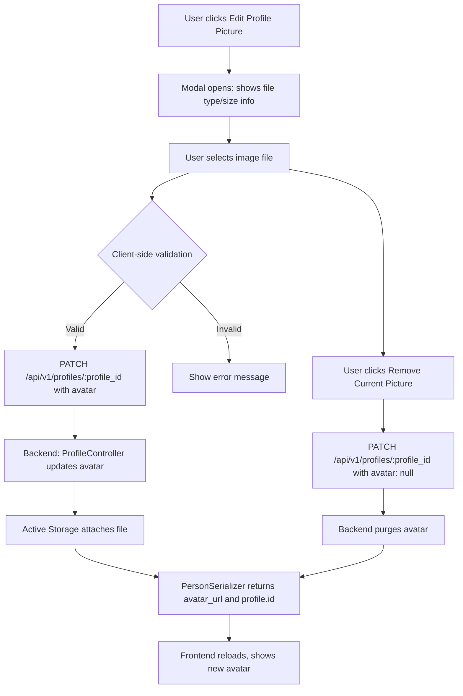

# ChronicleTree Development Roadmap

This document outlines the current state, recent progress, and future plans for the ChronicleTree full-stack application, including both the Rails API backend and the React client frontend.

---

## Enhanced Blood Relationship Validation System

ChronicleTree now features a comprehensive blood relationship validation system, ensuring realistic, legal, and culturally appropriate family structures. Key improvements include:

### 1. Comprehensive Blood Relationship Detection
- Advanced detection using `calculateRelationshipToRoot` from `improvedRelationshipCalculator.js`.
- Assigns numerical degrees (1-5) to measure closeness of blood relationships.
- Detects parents, children, siblings, grandparents, aunts, uncles, cousins, and more distant relatives.

### 2. Children Relationship Validation
- Prevents incest: blood relatives cannot have shared children.
- Covers all cases: siblings, parents, aunts, uncles, cousins, etc. cannot be co-parents.
- Clear error messages specify the relationship preventing the addition (e.g., "Blood relatives (Brother) cannot have shared children").

### 3. Enhanced Spouse Validation
- Prevents marriage between any blood relatives.
- Smart remarriage logic: allows marriage to ex/widowed spouse's relatives if no blood relation exists.
- Supports complex family scenarios (e.g., marrying into a family after a spouse dies/divorces).

### 4. Sophisticated Sibling Validation
- Hierarchical prevention: parents, grandparents, aunts, uncles cannot become siblings.
- Multi-generational: prevents impossible relationships across generations.
- Maintains logical family tree structure.

### 5. Enhanced Parent Validation
- Reverse relationship check: children and grandchildren cannot become parents.
- Maintains generational order in the family tree.

### 6. Advanced User Feedback
- Detailed filtering explanations for why people are filtered out.
- Visual indicators: color-coded information boxes for different constraint types.
- Educational: helps users understand family relationship rules.

### 7. Blood Relationship Degrees (Examples)
- Degree 1: Parent/Child, Siblings
- Degree 2: Grandparent/Grandchild, Uncle/Aunt-Nephew/Niece
- Degree 3: Great-Grandparent/Great-Grandchild, 1st Cousins
- Degree 4: 2nd Cousins
- Degree 5: Distant blood relatives

### 8. Complex Remarriage Scenarios Supported
- ✅ Allowed: Marrying ex-spouse's sibling (if no blood relation)
- ✅ Allowed: Marrying deceased spouse's relative (if no blood relation)
- ❌ Prevented: Marrying any blood relative regardless of previous marriages
- ❌ Prevented: Any incestuous relationships

### 9. Real-World Family Constraints
- Enforces biological reality and realistic family structure rules.
- Prevents relationships considered inappropriate in most cultures.
- Aligns with legal marriage restrictions in most jurisdictions.
- Prevents relationships that could lead to genetic issues.

### 10. Integration with Existing System
- Leverages backend Rails validation system.
- Maintains compatibility with step-relationship and in-law functionality.
- Performance optimized with efficient relationship mapping and caching.
- Graceful error handling when tree data is unavailable.

This system provides comprehensive protection against inappropriate family relationships while supporting realistic and complex family situations, such as remarriage within extended family networks.

## Visualization Library Update

- The family tree visualization is now implemented using [React Flow (xyflow)](https://xyflow.com/) for advanced support of complex family structures, generational layouts, and interactive features.
- All legacy visx/d3-hierarchy code and dependencies have been removed. The codebase no longer uses visx for tree rendering.
- The new React Flow-based tree supports:
  - Generational/family layout (in progress)
  - Grouping of couples and shared children
  - Support for multiple parents, divorces, and complex relationships
  - Advanced features such as drag-and-drop, edge editing, and re-centering (planned)
- See [xyflow/xyflow GitHub](https://github.com/xyflow/xyflow) and [example family tree](https://reactjsexample.com/a-family-tree-project-built-with-react-flow/) for reference.

---

## MiniMap Viewport Rectangle Improvements

- Refined the MiniMap viewport rectangle logic for the Family Tree page to ensure a visually clear, responsive, and user-friendly experience.
- The viewport rectangle now:
  - Always stays fully inside the MiniMap, even at extreme zoom/pan levels or when the visible area is larger than the node area.
  - Uses true proportional mapping for position and size, ensuring accuracy at all zoom and pan levels (no artificial scaling).
  - Moves smoothly and responsively, following the mouse or touch cursor as closely as possible during drag operations.
  - Supports both mouse and touch (mobile/tablet) interactions.
  - Uses requestAnimationFrame for smooth dragging and a CSS transition for smooth animation when not dragging.
  - Stores the pointer offset inside the rectangle on drag start, so the rectangle follows the cursor/finger precisely.
- All changes are isolated to the MiniMap rectangle logic; no unrelated UI or logic was changed.

**Next Steps:**
- Further refine the MiniMap viewport rectangle for even better accessibility, visual clarity, and usability. Consider adding keyboard navigation, improved focus states, and more granular touch support. Gather user feedback to guide future improvements.

These improvements make the MiniMap a robust and intuitive navigation tool for all users, regardless of device or zoom level.

---

## Recent Updates

### [2025-01-20] Temporal Validation for Parent-Child Relationships & UI Improvements
- **CRITICAL: Temporal Validation for Adding Children**: Added comprehensive validation to prevent adding children to deceased parents when the child's birth date is after the parent's death date:
  - **Frontend Validation**: Real-time validation in PersonForm with clear error messages showing parent's name and death date
  - **Backend Validation**: Server-side temporal validation with detailed error messages including formatted dates
  - **Chronological Accuracy**: Ensures family tree relationships respect temporal reality and biological possibility
  - **User Experience**: Provides immediate feedback explaining why invalid relationships cannot be created
- **UI Text Improvements**: Changed "Related Person" to "Selected Person" throughout the application for clearer terminology:
  - Updated form labels, error messages, and validation text
  - Improved consistency across frontend and backend error messages
- **Data Integrity**: Prevents impossible family relationships while preserving valid historical data
- **Step-Relationship Timeline Validation & Deceased Spouse Logic Improvements**:
- **CRITICAL FIX: Timeline Validation for Family Relationships**: Fixed issue where deceased people could show step-relationships with people born after their death (e.g., Michael Doe born 2024 incorrectly showing as Jane Doe's step-son when Jane died in 2022).
- **Enhanced Relationship Calculator Logic**: Added fundamental timeline validation at entry point to prevent impossible relationships between people who never coexisted:
  - People born after someone's death cannot have family relationships with the deceased (except direct blood inheritance)
  - Step-relationships now validate that the step-parent was alive when the child existed
  - "Late Spouse's Child" calculations include death date validation
- **Chronological Accuracy**: Family tree now respects temporal reality - relationships require people to have overlapped in time
- **Preserved Blood Relationships**: Direct parent-child and grandparent-grandchild relationships are preserved even across timeline gaps for inheritance tracking
- **Edge Case Handling**: Missing birth/death dates handled gracefully without breaking existing functionality
- **Deceased Spouse Relationship Logic Improvements**:
  - **Fixed In-Law Relationship Display**: Resolved critical issue where deceased spouse's parents were incorrectly showing as current in-laws for surviving spouses.
  - **Enhanced Backend Relationship Logic**: Updated `current_spouses` method in Person model to properly exclude deceased spouses from current relationship queries, ensuring accurate in-law calculations.
  - **Complex Spouse Status Handling**: Implemented support for complex scenarios where a person can be both an ex-spouse AND deceased (divorced then died vs died while married).
  - **Deceased Person Profile Logic**: Updated in-law methods (`parents_in_law`, `children_in_law`, `siblings_in_law`) to return empty arrays for deceased people, reflecting that deceased individuals don't maintain active in-law relationships.
  - **Frontend Display Perspective Fix**: Fixed relationship calculator to show proper labels based on perspective:
    - From living person's view: deceased spouse shows as "Late Husband/Wife"
    - From deceased person's view: living spouse shows as "Husband/Wife" (without "Late" prefix)
  - **Frontend Display Enhancements**: Enhanced RelationshipManager component with improved status display logic:
    - Ex-spouse status takes precedence over deceased status in display
    - Consistent gray styling for all deceased relationships
    - Proper year extraction and formatting for death dates
    - Clear visual distinctions between different spouse statuses
  - **Backend Model Updates**: Added new methods to Person model:
    - `deceased_spouses` - Returns spouses who have died
    - `is_deceased?` - Helper method to check if person is deceased
    - `all_spouses_including_deceased` - Returns all non-ex spouses (both living and deceased)
  - **Validation Logic Updates**: Removed conflicting spouse status validation that prevented ex+deceased combinations, allowing for more realistic family history scenarios.
  - **Comprehensive Test Coverage**: Added extensive test cases covering all spouse exclusion scenarios and complex relationship status combinations.
  - **Enhanced Serialization**: Updated person serializer to include `is_deceased` and `date_of_death` fields for proper frontend status display.

### [2025-07-17] Ex-Spouse In-Law Exclusion, Gender-Neutral Naming, and Relationship Logic Overhaul
- **Ex-Spouse In-Law Exclusion:**
  - Backend and frontend now strictly exclude ex-spouse relatives (parents, siblings, children) from in-law calculations, matching the problem statement: “relatives of spouse (because after divorce they are not official yet) are not showing.”
  - `Person` model now has `current_spouses` and `ex_spouses` for precise relationship queries.
  - Relationship model keeps reciprocal `is_ex` status in sync for spouse relationships.
  - All API endpoints and serializers updated to reflect these relationship changes.
- **Gender-Specific & Gender-Neutral Naming:**
  - Relationship calculator and UI now use gender-specific terms when gender is defined (e.g., “Father”, “Mother”, “Son”, “Daughter”) and neutral terms when not (e.g., “Child”, “Spouse”, “Parent’s sibling”).
  - Ex-spouse and in-law relationships use correct neutral or gendered terms as appropriate.
- **Deceased/Alive Status UI:**
  - Person cards and tree nodes now show deceased/alive status with clear UI, including year of death if applicable.
- **Social Sharing:**
  - Improved logic for sharing tree links and content across platforms.
- **Testing:**
  - Added and updated Vitest tests for ex-spouse handling, gender-neutral naming, and integration.
  - Integration tests confirm that ex-in-laws are not shown after divorce.

### [2025-07-01] Unified Notes, Profile Data, and Tree Node Display
- **Single Note per Person:** The backend now enforces a single, unique note per person (not per profile), with a dedicated model, migration, serializer, and API endpoints. This simplifies note management and aligns with real-world use.
- **Seed Data Overhaul:** All seed people have explicit IDs, gender, date_of_birth, and realistic values. Jane Doe is now marked as deceased (with a date of death) to enable robust UI testing of deceased status and date logic. Seeds include rich facts, timeline items, media, and relationships for comprehensive development/testing.
- **Profile Data Alignment:** The frontend now displays all profile data—facts, timeline, media, relationships, and notes—using keys and structures that match the backend API. All data is reliably shown in the UI, with no missing fields.
- **Age & Date Display Logic:**
  - "Age" is only shown under the avatar in the profile and at tree nodes as "{age} y.o.". It is removed from the "Basic Information" section and person cards to avoid redundancy.
  - Tree node status badge now displays "Deceased (YEAR)" if the person is deceased, with the year of death. No birth year is shown at the node for clarity.
  - Person cards show full date of birth and, if deceased, date of death, for accurate historical context.
- **UI/UX Consistency:** All changes are reflected in both backend and frontend, with careful attention to matching mockups and user expectations. The profile and tree are visually and functionally aligned.
- **Testing & Validation:** All changes have been tested and confirmed in both backend and frontend. The system is ready for further feature development and user feedback.

### [2025-06-30] Comprehensive Seed Data & First Person Logic
- `db/seeds.rb` now creates a fully connected, multi-generational family tree with all relationship types (parent, child, spouse, sibling, cousin, grandparent, etc.) for robust frontend and backend testing.
- Frontend and backend logic updated to allow creation of the first/root person without requiring a relationship type.
- Add Person modal now hides the relationship type field when adding the first person.
- All React Flow edge types are registered and visually distinct.
- Tree layout and zoom are dynamic and logical for any tree size.

### [2025-06-29] PersonForm & TreeView Fixes
- PersonForm now matches mockup: death date only enabled if "Deceased" is checked, relationship selection is present, and all register usages are correct.
- TreeView always shows people if any exist (uses first person as root if needed).
- Improved UX and reliability for adding people and visualizing the tree.

### [2025-06-29] Profile Page Refactor
- Profile page now displays the selected person from the tree, not the logged-in user.
- Route `/profile/:id` fetches and shows all profile data (details, timeline, media, facts, relationships) for the chosen person.
- Tabs and layout improved for extensibility and clarity.
- UI/UX structure matches mock-ups and is ready for further CRUD enhancements.

### [2025-06-29] CRUD Modal Unification & PersonCard Improvements
- All delete confirmations now use a single, reusable `ConfirmDeleteModal` component (no more `DeletePersonModal`).
- PersonCard UI/UX improved for consistency with mock-ups: clear action buttons, better layout, and modal flows.
- Added several sample people and relationships to the test user in `db/seeds.rb` for development and demo purposes.

### [2025-06-30] Robust Tree Visualization, Unified Modals, and Relationship Management
- Upgraded the React family tree to use a visually distinct, accessible, and interactive tree layout with clear node/edge types and a wider canvas.
- Unified all CRUD modals (`AddPersonModal`, `EditPersonModal`, `ConfirmDeleteModal`) for accessibility, single-modal logic, and consistent UI/UX.
- Ensured only one modal can be open at a time by centralizing modal state logic in `TreeStateContext.jsx`.
- Improved `PersonForm.jsx` to use `react-hook-form` with robust validation, accessibility, and enforced relationship selection with clear guidance.
- Added a persistent, accessible "+ Add Person" button with icon and text.
- Person card is now smaller, positioned near the node, and auto-closes on edit/delete; edit/delete handlers open the correct modals.
- Added a single toggle for node interactivity ("Move Nodes"); node movement is only possible when enabled.
- Moved `nodeTypes` and `edgeTypes` outside the `Tree` component to resolve React Flow warnings.
- Removed all debug logs and duplicate modal/toggle rendering from the codebase.
- Backend `/tree` and `/full_tree` endpoints and serializers updated for correct data structure and field mapping.

### [2025-06-30] Profile Page CRUD & Navigation Enhancements
- Profile page now uses modular components and matches the latest mock-up for layout, style, and UX.
- Added sticky header with share button and improved section cards for details, facts, timeline, media, and relationships.
- All modals (edit picture, add fact, add timeline, add media, share) are present and styled.
- Data fields and layout are mapped to backend and mock-up requirements.
- Navigation: Profile page links to relatives' profiles and tree/settings via `<Link>` components for seamless SPA navigation.
- Next steps: Implement full CRUD for facts, timeline, media, and relationships directly from the profile page, with optimistic updates and error handling.

### [2025-07-03] Profile Picture Upload & Avatar API Integration
- Profile page now supports uploading and removing a profile picture (avatar) for each person.
- Edit Profile Picture modal provides clear info on accepted file types (JPG, PNG, GIF) and max size (2MB), with client-side validation.
- Avatar upload/removal is fully integrated with the backend API and Active Storage.
- Backend API and serializer updated to expose the profile and its ID for reliable avatar actions from the frontend.
- All error states (invalid file, missing profile, upload failure) are handled gracefully in the UI.
- Seeds and schema confirmed: every person has a profile, and avatars are purged in seeds for clean test data.
- This completes the modern, mockup-aligned profile page with robust media and avatar support.

### [2025-07-03] Media Title Support & Gallery Improvements
- Added `title` column to the `media` table via migration; all media records now support a user-friendly title.
- Updated backend API to permit and save `title` for media uploads and edits (`media_params`).
- Updated seeds to include a `title` for each media record, ensuring clean test data and a better demo experience.
- Updated `MediumSerializer` to include `title` in API responses.
- Updated frontend media gallery to display only the media `title` (never the raw filename), with a fallback label if missing.
- Users can now set and edit a media title via the UI and API, improving clarity and usability in the profile gallery.

### [2025-07-03] Profile Navigation Streamlined
- Removed "Profile" from the main navigation bar (desktop and mobile) in the React client.
- Profile pages are now only accessible by clicking a person node or person card in the tree view, matching the intended user flow and mockups.
- This change reduces navigation clutter and ensures users always access profiles in the context of the family tree.

### [2025-07-12] API Authentication & Protection (Devise JWT)

- Enabled JWT authentication for all API endpoints using Devise and devise-jwt in API-only Rails mode.
- Configured Devise to use `navigational_formats = []` and default all routes to JSON for proper API behavior.
- Implemented a custom `SessionsController` with `respond_to :json` to resolve format/406 errors.
- All API endpoints (except sign-in, sign-up, password reset) are protected by `before_action :authenticate_user!` via `Api::V1::BaseController`.
- Confirmed that login at `/api/v1/auth/sign_in` returns a JWT token in the `Authorization` header, and authenticated requests succeed with a valid token.
- Documented the authentication flow for frontend integration:
  - Sign in: POST `/api/v1/auth/sign_in` with `{ user: { email, password } }` → receive JWT in `Authorization` header.
  - Use `Authorization: Bearer <token>` for all protected API requests.
  - Sign out: DELETE `/api/v1/auth/sign_out` (JWT is revoked).
- All changes tested and verified with curl and frontend client.

---

## Profile Picture (Avatar) Data Flow Diagram

- All error states (invalid file, upload failure, missing profile) are handled in the UI.
- Data always flows through the profile association, ensuring every person has a profile and avatar actions are reliable.

---

## Backend Development (Rails API)

This section outlines the current and planned development for the ChronicleTree Rails API, focusing on features, stability, and robust data.

### 1. API Endpoint Expansion

- All core resources (people, facts, timeline items, media, relationships, notes) have full CRUD endpoints.
- `/api/v1/people/:id/tree` and `/api/v1/people/:id/full_tree` return all data needed for tree visualization and profile display.
- All endpoints are protected with authentication and ownership checks.
- Nested and top-level routes for facts, media, and relationships are implemented.

### 2. Database Schema

- Migrations finalized for all models: Person, Relationship, Fact, TimelineItem, Media, Note, Profile.
- All associations, indexes, and foreign key constraints are in place for integrity and performance.
- `db/seeds.rb` provides comprehensive, realistic sample data for development and UI testing, including deceased people and all relationship types.

### 3. Service Objects

- `People::TreeBuilder` generates node/edge data for the frontend tree, including all relatives.
- Additional services may be added for media processing, data import/export, or advanced queries.

### 4. Testing Strategy (RSpec)

- Request specs cover all API endpoints, including authentication, authorization, and validation errors.
- Model/unit tests validate all business logic and associations.
- FactoryBot is used for robust test data.
- CI runs all tests and static analysis (RuboCop, Brakeman) on every pull request.

---

## Frontend Development (React Client)

This section outlines the current and planned development for the ChronicleTree React client.

### 1. Component Architecture & Styling

- All static HTML mockups have been converted to modular, reusable React components.
- Tailwind CSS is used for all styling.
- State is managed with React hooks and context; routing uses `react-router-dom`.

### 2. API Integration & State Management

- Axios is used for all API requests, with JWT authentication and auto-logout on 401.
- `@tanstack/react-query` manages server state, caching, and optimistic updates.
- All profile and tree data is fetched live from the backend and kept in sync.

### 3. Tree Visualization with React Flow

- The family tree is rendered with `React Flow`, using data from `/api/v1/people/:id/tree`.
- `TreeStateContext` manages UI state for the tree, including selected node and modal/card visibility.
- Nodes use a custom `CustomNode` component showing name, avatar, gender, age, and deceased status (with year if applicable).
- Person cards show full birth/death dates and all profile data.
- Pan/zoom, smooth centering, and a robust MiniMap are implemented.
- The MiniMap viewport rectangle is fully responsive and accessible, supporting both mouse and touch interactions, and always stays within bounds.

### 4. Forms and User Input

- All forms (person, fact, timeline, media, relationship) use `React Hook Form` and `Yup` for validation.
- Modals are unified and accessible; only one can be open at a time.
- All form flows match the latest mockups, including conditional fields (e.g., death date only if "Deceased" is checked).

### 5. Testing & CI

- All major components and flows are covered by unit and integration tests using Vitest and React Testing Library.
- CI runs all tests and linting on every pull request.
- Static analysis and accessibility checks are part of the CI pipeline.

---

## Future Plans & Next Steps

- Add advanced search and filtering for people and relationships.
- Implement export/import of tree data (e.g., GEDCOM support).
- Add user settings, notifications, and multi-user collaboration features.
- Continue to expand test coverage and improve accessibility.
- Gather user feedback for further UI/UX improvements.
- Explore AI-powered features for relationship suggestions and data enrichment.
- Expand documentation and onboarding guides for new users and contributors.
