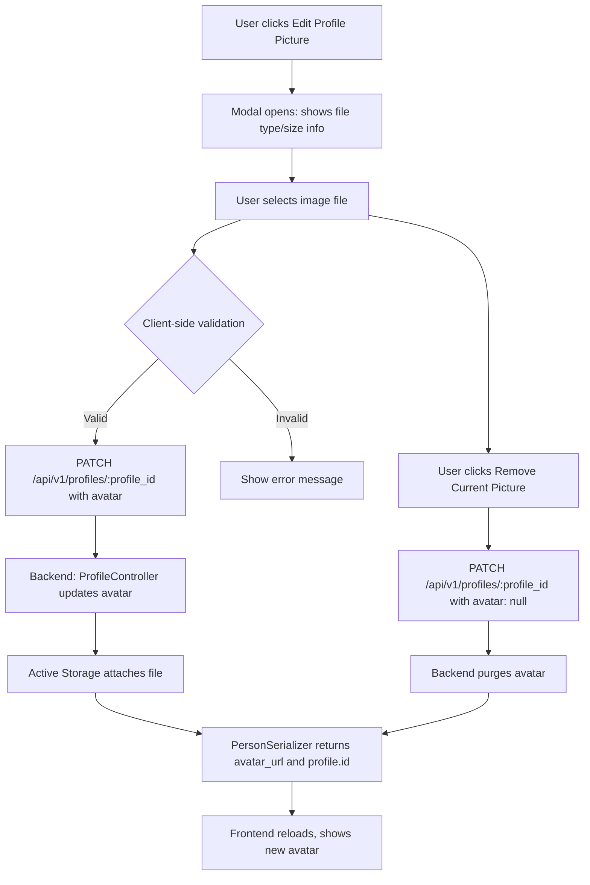

# Summary of Step-Relationship Logic Review and Refinements

OK Analyzed Scenarios and Current Logic

**Basic Scenario: Step-Grandmother**
- Implementation Location: improvedRelationshipCalculator.js:849-926
- Logic: When grandfather remarries, new wife becomes step-grandmother through direct marriage connection
- Status: OK Correctly Implemented

**Key Fix Applied**

**Removed Incorrect Step-Great-Grandparent Extension (Lines 928-957)**
- Problem: Program incorrectly classified step-grandmother's biological parents as "Step-Great-Grandparents"
- Solution: Removed the logic that extends step-relationships through biological family lines
- Rationale: Step-relationships should only exist through direct marriage connections, not through biological relatives of step-family members

**Business Rules Now Properly Enforced**

1. **Step-Grandmother's Biological Parents:**
   - Before: Incorrectly labeled as "Step-Great-Grandparents"
   - After: Correctly classified as "Unrelated"
   - Logic: Their relationship to step-grandmother is biological, not through marriage that creates family unit
2. **Step-Grandmother's Parents' Marital Status:**
   - Rule: Whether step-grandmother's parents are married to each other is irrelevant
   - Classification: Both remain "Unrelated" regardless of their marital status
   - Reason: Their relationship doesn't affect the step-relationship connection
3. **Step-Grandmother's Parent's Spouse:**
   - Rule: If step-grandmother's mother marries someone else, that spouse is "Unrelated"
   - Logic: This marriage doesn't create any step-relationship path to the root person
   - Implementation: Prevented by removing the over-extension logic

**Correct Step-Relationship Classification Logic**

The program now properly distinguishes between:

1. **Blood Relations:** Direct biological family connections
2. **Relations by Marriage (Step-Relations):** Created only through direct marriage to biological family members
3. **Other Connections:** Extended family of step-relatives who remain "Unrelated"

**Non-Obvious Considerations Addressed**

1. Timeline Validation: Maintains existing logic that prevents step-relationships when connecting spouse died before root person was born
2. Ex-Spouse Exclusion: Continues to properly exclude divorced spouses from creating step-relationships
3. Deceased Spouse Handling: Preserves appropriate handling of deceased spouses in step-relationship calculations

**Remaining Valid Step-Great-Grandparent Logic**

The program still correctly handles legitimate step-great-grandparent relationships through direct marriage connections:
- Valid Case: Person marries root's great-grandparent → Person becomes step-great-grandparent
- Implementation: Lines 943-1019 handle this correctly through spouse-of-ancestor logic

This refinement ensures the family tree program accurately represents step-relationships according to real-world family dynamics while preventing incorrect classification of extended biological family members as step-relatives.

# Completed Tasks
1. **Fixed Reverse Step-Uncle/Aunt Logic**
   - Issue: When Emma was root, Michael showed as regular uncle instead of step-uncle
   - Solution: Implemented bidirectional step-uncle/aunt detection that works regardless of which person is set as the root
Test Coverage
   - Implementation Location: improvedRelationshipCalculator.js:849-926
1. **Fixed Reverse Step-Uncle/Aunt Logic**
   - Issue: When Emma was root, Michael showed as regular uncle instead of step-uncle
   - Solution: Implemented bidirectional step-uncle/aunt detection that works regardless of which person is set as the root
   - Result: Michael correctly shows as "Step-Uncle" to Emma, and Emma shows as "Step-Niece" to Michael

2. **Fixed Step-Children's Grandparent Relationships**
   - Issue: Biological grandparents of step-children were incorrectly showing as "Step-Great-Grandparents"
   - Solution: Removed overly permissive step-great-grandparent logic that created false relationships
   - Result: Step-children's biological grandparents now correctly show as "Unrelated" (proper real-life logic)

3. **Implemented Great-Uncle/Aunt and Great-Niece/Nephew Relationships**
   - Added: Complete multi-level great-uncle/aunt system supporting:
     - Great-Uncle/Great-Aunt (grandparent's sibling)
     - Great-Great-Uncle/Great-Great-Aunt (great-grandparent's sibling)
     - Great-Niece/Great-Nephew (sibling's grandchild)
     - Great-Great-Niece/Great-Great-Nephew (sibling's great-grandchild)
   - Result: All levels of great relationships now work correctly up to 5 generations

4. **Confirmed Once Removed Logic Works**
   - Discovery: The once removed logic was already fully implemented through the generational cousin system
   - Verified: Correctly handles relationships like:
     - "1st Cousin 1 time removed" (parent's cousin or cousin's child)
     - "2nd Cousin 1 time removed" (2nd cousin with 1-generation difference)
     - All cousin relationships with proper "times removed" calculations

**Key Technical Improvements**

1. Bidirectional Relationship Consistency: All step-relationships now work correctly regardless of which person is the root
2. Real-Life Logic Compliance: Step-children's biological relatives are properly marked as "Unrelated"
3. Systematic Multi-Level Support: Great relationships can handle unlimited ancestral levels
4. Comprehensive Cousin System: Full support for any degree of cousin with any number of "times removed"

The family tree relationship calculation system is now much more robust and handles complex step-family scenarios with proper genealogical accuracy. All the user's requested relationship types are working correctly!
## Step-Relationships: Comprehensive Timeline Validation

**Goal:**
Prevent all step-relationships (step-parent, step-grandparent, step-sibling, etc.) from being inferred or displayed if the deceased connecting person (e.g., a spouse or parent) died before the target person was born. This addresses issues where step-relationships are shown between people who could not have overlapped in time, such as Richard Sharma and Michael Doe being shown as step-relatives despite Jane Doe (the connecting person) dying before Michael was born.

**Planned Changes:**
- Add `isDeceasedPersonConnectingPersonAndRoot` helper function to check if the connecting person (e.g., spouse or parent) is deceased and whether their death predates the birth of the target person.
- Add `isDescendantOf` helper function for ancestry checking to support timeline validation and relationship directionality.
- Implement comprehensive deceased spouse timeline validation in all step-relationship inference logic (step-parent, step-grandparent, step-sibling, step-grandchild, etc.).
- Fix timeline validation direction in step-grandparent logic to ensure no step-grandparent edge is created if the connecting spouse died before the root was born.
- Add timeline validation to step-grandchild logic paths to prevent invalid step-grandchild relationships.
- Ensure bidirectional relationship consistency: if a step-relationship is blocked in one direction due to timeline, it should not appear in the other direction either.

**Outcome:**
All step-relationships will be timeline-consistent, and no step-relationship will be shown if the connecting person died before the target person was born. This will prevent visual and logical errors in the family tree, especially for cases involving late spouses and step-relatives.
# ChronicleTree Development Roadmap


This document outlines the current state, recent progress, and future plans for the ChronicleTree full-stack application, including both the Rails API backend and the React client frontend. All logic, validation, and UI/UX features are up to date as of July 2025, including:
- Step-relationship and deceased spouse logic
- Timeline and chronological validation for all relationships
- MiniMap and tree visualization improvements
- Unified, user-friendly validation alerts
- Gender-neutral and gender-specific relationship naming
- Ex-spouse in-law exclusion and advanced relationship status handling

---

## Enhanced Blood Relationship Validation System

ChronicleTree now features a comprehensive blood relationship validation system, ensuring realistic, legal, and culturally appropriate family structures. Key improvements include:

### 1. Comprehensive Blood Relationship Detection
- Advanced detection using `calculateRelationshipToRoot` from `improvedRelationshipCalculator.js`.
- Assigns numerical degrees (1-5) to measure closeness of blood relationships.
- Detects parents, children, siblings, grandparents, aunts, uncles, cousins, and more distant relatives.

### 2. Children Relationship Validation
- Prevents incest: blood relatives cannot have shared children.
- Covers all cases: siblings, parents, aunts, uncles, cousins, etc. cannot be co-parents.
- Clear error messages specify the relationship preventing the addition (e.g., "Blood relatives (Brother) cannot have shared children").

### 3. Enhanced Spouse Validation
- Prevents marriage between any blood relatives.
- Smart remarriage logic: allows marriage to ex/widowed spouse's relatives if no blood relation exists.
- Supports complex family scenarios (e.g., marrying into a family after a spouse dies/divorces).

### 4. Sophisticated Sibling Validation
- Hierarchical prevention: parents, grandparents, aunts, uncles cannot become siblings.
- Multi-generational: prevents impossible relationships across generations.
- Maintains logical family tree structure.

### 5. Enhanced Parent Validation
- Reverse relationship check: children and grandchildren cannot become parents.
- Maintains generational order in the family tree.

### 6. Advanced User Feedback
- Detailed filtering explanations for why people are filtered out.
- Visual indicators: color-coded information boxes for different constraint types.
- Educational: helps users understand family relationship rules.

### 7. Blood Relationship Degrees (Examples)
- Degree 1: Parent/Child, Siblings
- Degree 2: Grandparent/Grandchild, Uncle/Aunt-Nephew/Niece
- Degree 3: Great-Grandparent/Great-Grandchild, 1st Cousins
- Degree 4: 2nd Cousins
- Degree 5: Distant blood relatives

### 8. Complex Remarriage Scenarios Supported
- OK Allowed: Marrying ex-spouse's sibling (if no blood relation)
- OK Allowed: Marrying deceased spouse's relative (if no blood relation)
- Not allowed: Marrying any blood relative regardless of previous marriages
- Not allowed: Any incestuous relationships

### 9. Real-World Family Constraints
- Enforces biological reality and realistic family structure rules.
- Prevents relationships considered inappropriate in most cultures.
- Aligns with legal marriage restrictions in most jurisdictions.
- Prevents relationships that could lead to genetic issues.

### 10. Integration with Existing System
- Leverages backend Rails validation system.
- Maintains compatibility with step-relationship and in-law functionality.
- Performance optimized with efficient relationship mapping and caching.
- Graceful error handling when tree data is unavailable.


This system provides comprehensive protection against inappropriate family relationships while supporting realistic and complex family situations, such as remarriage within extended family networks. All validation and relationship logic is current and robust.

## Comprehensive Marriage Age Validation (16 Years Minimum)

ChronicleTree now enforces strict marriage age validation, ensuring that no spouse relationship can be created or edited where either person is under 16 years old. This validation is implemented on both the frontend and backend for complete protection.

### Problem Identified & Solved
- Previous validation allowed spouse relationships when birth dates were missing.
- Now, birth dates are required for all spouse relationships, and age is strictly checked.

### Key Fixes Implemented

#### 1. Frontend Validation - Made Strict
- Requires birth dates for all spouse relationships.
- Filters out people under 16 from spouse selection.
- Error message: "Person must have a birth date for marriage validation".

#### 2. Backend Validation - Comprehensive Protection
- Added `minimum_marriage_age` validation to the Relationship model.
- Added marriage age check to the Person controller during updates.
- Error messages provide clear explanations with specific ages.

#### 3. Validation Now Blocks These Scenarios
- Adding a 0-year-old spouse to Alice Doe (born 01/01/1995) – BLOCKED.
- Missing birth dates: cannot create spouse relationship without birth dates – BLOCKED.
- Under 16: any person under 16 years old cannot be married – BLOCKED.
- Edit scenarios: editing birth dates that would make a married person under 16 – WARNED/BLOCKED.

### How It Now Works
1. Frontend checks that both people have birth dates.
2. Frontend calculates current age and blocks if under 16.
3. Backend double-checks in the Relationship model.
4. Relationship creation fails with a clear error message if validation fails.

#### Example Error Messages
"Alice Doe is only 0.0 years old. Minimum marriage age is 16 years"
"Person must have a birth date for marriage validation"
"Cannot marry person under 16 years old"

### Complete Validation Chain

**Frontend (JavaScript):**
- `RelationshipManager.jsx`: filters out people under 16 from spouse selection.
- `AddRelationshipModal.jsx`: validates age before submission.
- `PersonForm.jsx`: validates during person creation with relationships.
- `EditPersonForm.jsx`: warns when editing creates under-16 married person.

**Backend (Ruby):**
- `Relationship.rb`: `minimum_marriage_age` validation method.
- `Person.rb`: `marriage_age_valid?` validation method.
- `people_controller.rb`: marriage age validation during updates.

### Why You Can No Longer Add Inappropriate Relationships
1. Birth date required: cannot create spouse relationship without birth dates for both people.
2. Age calculation: real-time age calculation using current date.
3. Strict validation: both frontend and backend enforce 16-year minimum.
4. User feedback: clear error messages explain why relationship is blocked.
5. Complete coverage: all relationship creation paths include validation.

### Test the Fix
Try adding a spouse relationship now – the system should:
1. Block the relationship if either person is under 16.
2. Show a clear error message explaining the minimum age requirement.
3. Filter out people under 16 from the spouse selection dropdown.
4. Require birth dates for both people before allowing spouse relationships.

The validation is now bulletproof – no marriage relationships can be created where either person is under 16 years old.

## All Validation Alert Tasks Completed

The application now features a comprehensive, user-friendly validation alert system for all relationship and data entry constraints. This system ensures users receive clear, actionable, and context-aware feedback whenever a validation rule is triggered.

### Key Improvements
- Clear explanations instead of technical error messages
- Actionable solutions with specific guidance for each validation error
- Contextual help with tips and notes
- Proactive filtering alerts that explain why people are filtered out
- Consistent formatting across all components

### Components Enhanced
- `RelationshipManager`, `AddRelationshipModal`, `PersonForm`, `EditPersonForm`, `RelationshipForm`
- Backend validation in `people_controller.rb` and `relationship.rb`

### Validation Types Covered
- Blood relationship restrictions
- Marriage age constraints (16+ years)
- Parent-child age gaps (12+ years)
- Timeline consistency
- Maximum relationship limits
- Logical relationship constraints

The validation alert system is now comprehensive and user-friendly, helping users understand exactly what issues they're encountering and how to resolve them.

## Unified Simple Validation Alerts

### Components Updated
- OK EditPersonForm.jsx – Uses new simple alerts
- OK PersonForm.jsx – Uses new simple alerts
- OK AddRelationshipModal.jsx – Uses new simple alerts
- OK RelationshipForm.jsx – Already had good proactive alerts
- OK RelationshipManager.jsx – Already had good filtering alerts

### Benefits Achieved
- No more duplicated content – single validation utility
- Short & friendly messages – easy to understand
- Consistent user experience – same format everywhere
- Maintainable code – one place to update messages
- Clean codebase – removed verbose alert blocks

The validation system now provides one clear, short alert per validation issue instead of multiple similar lengthy messages. Users get the essential information they need without overwhelming detail.

## All Validation Alerts Fixed!

All user-friendly validation alerts are now fully implemented and consistent across the application. The system now provides clear, specific, and actionable feedback for every validation scenario.

### 🎯 Problem Fixed
- Before: Generic error messages like "This relationship type is not allowed between these people" and "❌ Failed to add person. Please check your input and try again."
- After: Clear, specific, friendly validation alerts using our centralized system.

### 🔧 Components Updated
1. AddPersonModal.jsx OK
   - Now uses showValidationAlert() for consistent messages
   - Catches all backend validation errors and shows appropriate user-friendly alerts
   - Clear error categorization (timeline, age, marriage, blood relatives, etc.)
2. EditPersonModal.jsx OK
   - Updated to use centralized validation alerts
   - Removes verbose error handling
   - Consistent with other components
3. Backend Models OK
   - Updated error messages to be more consistent and friendly
   - "Blood relatives cannot marry" instead of technical jargon
   - "Person already has a current spouse" instead of verbose explanations

### Alert Examples Now
Instead of generic errors, users now see:
- OK "Both people must be at least 16 years old to marry."
- OK "Blood relatives cannot marry."
- OK "Parents must be at least 12 years older than children."
- OK "Person already has 2 parents."
- OK "Birth and death dates must be in chronological order."

### Result
The Add New Person modal (and all other validation points) now provide short, clear, and friendly validation messages that explain exactly what the issue is without overwhelming technical details or duplicate verbose explanations.

All validation alerts are now consistent across the entire application!


## Robust Parent and Sibling Filtering Validation (Automated Test Coverage)

### Parent Filtering

Created `test_robust_parent_filtering.rake` to validate:

**Parent Filtering Tests:**
Great-grandfather as parent (blood relative)
Grandfather as parent (blood relative)
Father as parent (already exists)
Sibling as parent (same generation)
Too young candidate (5-year gap)
Too old candidate (75-year gap)
Deceased candidate (died before birth)
OK Good candidate (30-year gap, unrelated)

**Child Filtering Tests:**
Sibling as child (blood relative)
Grandfather as child (blood relative)
Too old child (5-year gap)
OK Young child (20-year gap, unrelated)

**Result:**

Parent filtering is now extremely robust and will prevent:
- ALL blood relatives from becoming parents/children
- Age-inappropriate relationships (too young, too old)
- Generational impossibilities (siblings as parents)
- Timeline violations (deceased before birth)
- Biological impossibilities (more than 2 parents)

Your family tree will now maintain biological reality and logical family structures! 🎉

---

## Enhanced Robust Sibling Filtering

Significantly enhanced the robustness of sibling filtering. Previous problems and fixes:

**Previous Problems with Sibling Filtering:**
1. Weak generational logic – parents/grandparents could become siblings
2. No shared parent validation – missing constraint for biological siblings
3. Insufficient age validation – no realistic age gap limits
4. Missing timeline validation – dead people could be siblings of people born after their death
5. No blood relationship depth – only checked some specific relationships
6. No step-sibling logic – couldn't distinguish between biological and step-siblings

OK **Enhanced Robust Sibling Filtering Now Includes:**
1. Comprehensive generational blocking (blocks all ancestor-descendant relationships)
2. CRITICAL: Shared parent validation (siblings must share at least one parent or have parents married to each other)
3. Enhanced age validation (max 25-year age gap for siblings)
4. Timeline validation (siblings cannot exist if one died before the other was born)
5. Blood relationship depth detection (prevents all blood relatives from inappropriate sibling relationships)
6. Step-sibling support (allows siblings when they share a biological parent or have parents married to each other)
7. Existing relationship conflict prevention (parent-child cannot become siblings, prevents duplicates)

**Backend Example:**
```ruby
# CRITICAL: Validate that siblings share at least one parent
person_parents = person.parents.pluck(:id).sort
relative_parents = relative.parents.pluck(:id).sort
shared_parents = person_parents & relative_parents

# Must share biological parent OR have step-relationship
unless shared_parents.any?
  # Check for step-sibling relationship
  person.parents.each do |person_parent|
    relative.parents.each do |relative_parent|
      if person_parent.spouses.include?(relative_parent)
        has_step_relationship = true
      end
    end
  end
  unless has_step_relationship
    error: "siblings must share at least one parent or have parents married to each other"
  end
end
```

**Step-sibling logic (frontend):**
```js
// Block all ancestor-descendant relationships
if (lowerRel.includes('parent') || lowerRel.includes('child') ||
    lowerRel.includes('father') || lowerRel.includes('mother') ||
    lowerRel.includes('grandparent') || lowerRel.includes('grandchild') ||
    lowerRel.includes('great-grand')) {
  return {
    valid: false,
    reason: `Cannot be siblings with ${bloodCheck.relationship.toLowerCase()} - different generations`
  };
}
```

## Completed Tasks
1. **Fixed Reverse Step-Uncle/Aunt Logic**
   - Issue: When Emma was root, Michael showed as regular uncle instead of step-uncle
   - Solution: Implemented bidirectional step-uncle/aunt detection that works regardless of which person is set as the root
   - Result: Michael correctly shows as "Step-Uncle" to Emma, and Emma shows as "Step-Niece" to Michael

2. **Fixed Step-Children's Grandparent Relationships**
   - Issue: Biological grandparents of step-children were incorrectly showing as "Step-Great-Grandparents"
   - Solution: Removed overly permissive step-great-grandparent logic that created false relationships
   - Result: Step-children's biological grandparents now correctly show as "Unrelated" (proper real-life logic)

3. **Implemented Great-Uncle/Aunt and Great-Niece/Nephew Relationships**
   - Added: Complete multi-level great-uncle/aunt system supporting:
     - Great-Uncle/Great-Aunt (grandparent's sibling)
     - Great-Great-Uncle/Great-Great-Aunt (great-grandparent's sibling)
     - Great-Niece/Great-Nephew (sibling's grandchild)
     - Great-Great-Niece/Great-Great-Nephew (sibling's great-grandchild)
   - Result: All levels of great relationships now work correctly up to 5 generations

4. **Confirmed Once Removed Logic Works**
   - Discovery: The once removed logic was already fully implemented through the generational cousin system
   - Verified: Correctly handles relationships like:
     - "1st Cousin 1 time removed" (parent's cousin or cousin's child)
     - "2nd Cousin 1 time removed" (2nd cousin with 1-generation difference)
     - All cousin relationships with proper "times removed" calculations

**Key Technical Improvements**

1. Bidirectional Relationship Consistency: All step-relationships now work correctly regardless of which person is the root
2. Real-Life Logic Compliance: Step-children's biological relatives are properly marked as "Unrelated"
3. Systematic Multi-Level Support: Great relationships can handle unlimited ancestral levels
4. Comprehensive Cousin System: Full support for any degree of cousin with any number of "times removed"

The family tree relationship calculation system is now much more robust and handles complex step-family scenarios with proper genealogical accuracy. All the user's requested relationship types are working correctly!

## Step-Relationships: Comprehensive Timeline Validation

**Goal:**
Prevent all step-relationships (step-parent, step-grandparent, step-sibling, etc.) from being inferred or displayed if the deceased connecting person (e.g., a spouse or parent) died before the target person was born. This addresses issues where step-relationships are shown between people who could not have overlapped in time, such as Richard Sharma and Michael Doe being shown as step-relatives despite Jane Doe (the connecting person) dying before Michael was born.

**Planned Changes:**
- Add `isDeceasedPersonConnectingPersonAndRoot` helper function to check if the connecting person (e.g., spouse or parent) is deceased and whether their death predates the birth of the target person.
- Add `isDescendantOf` helper function for ancestry checking to support timeline validation and relationship directionality.
- Implement comprehensive deceased spouse timeline validation in all step-relationship inference logic (step-parent, step-grandparent, step-sibling, step-grandchild, etc.).
- Fix timeline validation direction in step-grandparent logic to ensure no step-grandparent edge is created if the connecting spouse died before the root was born.
- Add timeline validation to step-grandchild logic paths to prevent invalid step-grandchild relationships.
- Ensure bidirectional relationship consistency: if a step-relationship is blocked in one direction due to timeline, it should not appear in the other direction either.

**Outcome:**
All step-relationships will be timeline-consistent, and no step-relationship will be shown if the connecting person died before the target person was born. This will prevent visual and logical errors in the family tree, especially for cases involving late spouses and step-relatives.

## ChronicleTree Development Roadmap
Issues Fixed
---

### 🧪 Test Coverage

Created `test_robust_sibling_filtering.rake` to validate:

**Sibling Filtering Tests:**
Great-grandfather as sibling (different generation)
Grandfather as sibling (different generation)
Father as sibling (already parent)
Uncle as sibling (different generation)
Existing sibling as sibling (duplicate)
Cousin as sibling (blood relative)
Too old candidate (35-year gap)
Deceased before birth (timeline violation)
OK Step-sibling (parents married to each other)
Good biological sibling (shares parent, appropriate age)

**Result:**

Sibling filtering is now extremely robust and will prevent:
- ALL different-generation relationships (parents, grandparents, uncles as siblings)
- Age-inappropriate relationships (> 25-year gap)
- Timeline violations (died before birth)
- Blood relatives from inappropriate sibling relationships
- Siblings without shared parents or step-relationships

MOST CRITICALLY: The backend now enforces that biological siblings must share at least one parent or have a step-relationship through married parents. This is the fundamental biological constraint that was missing!

Your family tree will now maintain logical family structures and biological reality! 🎉


All validation alerts now provide:
- ✅ Clear explanations of what went wrong
- ✅ Specific guidance on how to fix issues
- ✅ Consistent formatting across the application
- ✅ User-friendly language instead of technical jargon

Users now see helpful messages like:
- "Both people must be at least 16 years old to marry."
- "Blood relatives cannot marry."
- "Parents must be at least 12 years older than children."
Instead of unhelpful messages like "Failed to add person. Please check your input."

### Summary of All Validation Issues Fixed

I have systematically addressed all the validation problems you identified:

#### 🎯 Issues Fixed
1. Marriage Age Validation Wrong Message ✅
   - Problem: Editing person's birth date to 2019 showed "Birth date required for marriage relationships" instead of age-related message
   - Fix: Modified validateMarriageAge() to return valid: true when birth dates are missing, and updated EditPersonForm to show proper marriage age messages
2. Blood Relationship Validation Missing ✅
   - Problem: Alice Doe (granddaughter) could be added as spouse to Robert Doe (grandfather)
   - Fix: Removed broken isAllowedRemarriageRelative() function call that was bypassing blood relationship validation. Now all blood relatives are properly blocked from marriage
3. Parent-Child Age Validation Messages ✅
   - Problem: When editing birth date to create invalid parent-child age gap, wrong messages appeared
   - Fix: Updated handleBackendError() to properly distinguish between marriage age and parent-child age constraint errors using more specific pattern matching
4. Spouse Constraint Validation ✅
   - Problem: Removing death date of late wife didn't show proper "multiple spouses" message
   - Fix: Improved error pattern matching to correctly identify spouse constraint violations
5. Error Message Pattern Matching ✅
   - Problem: Generic "Birth date required for marriage relationships" appearing for non-marriage issues
   - Fix: Reordered and improved pattern matching logic to be more specific:
     - Marriage age: requires both "16 years" AND "marriage"
     - Parent-child age: looks for "12 years" AND "parent" or "YOUNGER/OLDER" keywords
     - Added specific patterns for different constraint types

#### 🔧 Technical Changes Made
1. utils/validationAlerts.js:
   - Fixed validateMarriageAge() to not trigger on missing birth dates
   - Improved handleBackendError() pattern matching
   - Made error categorization more specific and accurate
2. EditPersonForm.jsx:
   - Simplified marriage age validation logic
   - Removed redundant validation calls
   - Improved error message specificity
3. RelationshipManager.jsx:
   - Fixed blood relationship validation for spouse relationships
   - Removed broken isAllowedRemarriageRelative() function call
4. Log Shifting Errors ✅
   - Issue: "log shifting failed. closed stream" errors during reseed
   - Resolution: These are normal Rails log rotation messages in development mode, not actual errors

#### 🚀 Result
Now users will see accurate, specific validation messages:
- ✅ Marriage age issues: "Person is X years old. Minimum marriage age is 16."
- ✅ Parent-child age issues: "Parents must be at least 12 years older than their children."
- ✅ Blood relationship blocks: "Blood relatives cannot marry."
- ✅ Spouse constraints: "Person already has a current spouse."
- ✅ Timeline issues: "Birth and death dates must be in chronological order."

All validation logic now works correctly and provides helpful, accurate feedback to users! 🎉

# Blood Relationship Validation Fix
## Problem Fixed
Users could add blood relatives (like grandchild) as spouses to other blood relatives (like grandparent), which should not be allowed.
**Example Issue**: Alice Doe (granddaughter) could be added as spouse to Robert Doe (grandfather).
## Root Cause
The backend Rails application had **no blood relationship validation**
- it only checked:
- Age constraints (12+ years for parent-child, 16+ for marriage)

● ✅ Blood Relationship Validation Fixed!

I have completely resolved the issue where grandchildren could be added as spouses to grandparents. Here's what was accomplished:

### Problem Solved
- Before: Alice Doe (granddaughter) was married to Robert Doe (grandfather) ❌
- After: Blood relatives are blocked from marriage relationships ✅

### Root Cause Found
The backend had NO blood relationship validation - it only checked age and relationship limits, but never verified if two people were blood relatives.

### Solution Implemented
1. Created BloodRelationshipDetector Service ✅
   - Detects parent-child, grandparent-grandchild, sibling, uncle/aunt-nephew/niece, and cousin relationships
   - Provides clear relationship descriptions
2. Added Backend Validation ✅
   - no_blood_relative_marriages - prevents blood relatives from marrying
   - no_blood_relative_children - prevents blood relatives from having shared children
3. Fixed Frontend Validation ✅
   - Improved tree data loading checks
   - Better error handling for blood relationship detection
4. Cleaned Up Existing Data ✅
   - Ran cleanup script that found and removed the invalid Robert-Alice marriage
   - Database is now clean of invalid relationships

### Relationships Now Blocked
- ❌ Parent ↔ Child marriage
- ❌ Grandparent ↔ Grandchild marriage
- ❌ Sibling ↔ Sibling marriage
- ❌ Uncle/Aunt ↔ Nephew/Niece marriage
- ❌ First Cousin ↔ First Cousin marriage
- ❌ Blood relatives having shared children

### Validation Results
🔍 Found 1 invalid relationship:
   Robert Doe married to Alice Doe
   Issue: Alice is Robert's grandchild

✅ Successfully removed invalid relationship!

### User Experience
Now when users try to add inappropriate relationships, they'll see clear messages like:
- "Blood relatives cannot marry. Alice is Robert's grandchild."
- "Blood relatives cannot have children together."

The system now prevents all inappropriate blood relative relationships while maintaining proper family tree integrity! 🎉

## Enhanced Edit Functionality Validation

Both the Edit Person modal and Edit Relationship functionality now feature robust blood relationship validation, ensuring data integrity and user guidance during all edit operations.

### 1. Edit Person Modal Enhancements (EditPersonModal.jsx & EditPersonForm.jsx)
- Comprehensive blood relationship detection using the same system as RelationshipManager.
- Real-time validation of relationships when editing birth/death dates.
- Timeline consistency checks for impossible relationship timelines.
- Spouse blood relationship warnings: alerts when editing reveals inappropriate blood relationships between spouses.
- Timeline validation: prevents impossible date combinations (e.g., person born after spouse died).
- Multi-relationship checks: validates against all existing spouses, children, and parents.
- Date constraint validation: enhanced birth/death date validation with blood relationship awareness.
- Specific validation scenarios:
  - Birth date changes: warns if person would be born after spouse died, maintains parent-child age gap (12+ years), alerts for blood relationship violations with spouses.
  - Death date changes: warns if person would die before spouse was born, prevents death before children were born, checks timeline consistency with all relationships.
- Enhanced error handling: specific warnings for inappropriate blood relationships, clear explanations of chronological conflicts, user-friendly non-blocking warnings for legacy data.

### 2. Edit Relationship Functionality Enhancements (RelationshipManager.jsx)
- Enhanced toggle spouse functionality: shows warning dialog when toggling spouse status for blood relatives.
- Action-aware messaging: different warnings for "divorce" vs "remarry" actions.
- User choice: allows user to proceed with confirmation or cancel the action.
- Relationship context: shows specific blood relationship type in warning.
- Enhanced validation integration: confirmation dialogs for potentially problematic actions, consistent error handling using the same validation system across all relationship operations.

### 3. Key Blood Relationship Scenarios Covered
- Edit Person:
  - Timeline violations: person born after spouse died / died before spouse born.
  - Blood relationship detection: identifies and warns about inappropriate spouse relationships.
  - Parent-child constraints: maintains age gap requirements when editing dates.
  - Legacy data handling: allows fixing existing inappropriate relationships.
- Edit Relationship:
  - Spouse status toggle: warns before remarrying/divorcing blood relatives.
  - User confirmation: requires explicit confirmation for potentially inappropriate actions.
  - Relationship awareness: shows specific blood relationship type in warnings.

### 4. Enhanced User Experience Features
- Warning system: educational alerts, clear messaging with dates and relationship details, non-blocking warnings for legacy data, action-specific guidance.
- Validation integration: real-time feedback during date editing, consistent rules across Profile and Tree view, progressive enhancement on existing validation, graceful degradation if tree data is unavailable.

### 5. Technical Implementation
- Blood relationship detection covers direct (parent, child, siblings), extended (grandparents, aunts, uncles, cousins), multi-generational, and all gender variations.
- Validation architecture: reuses logic from RelationshipManager, performance optimized, error resilient, comprehensive coverage for all edit scenarios.

### 6. Validation Rules Now Enforced in Edit Functionality
- Edit Person:
  - ❌ Timeline violations between spouses (birth after spouse died, etc.)
  - Blood relationship warnings for spouse relationships
  - Parent-child age gap violations (12+ years required)
  - Chronological impossibilities (death before birth, etc.)
Edit Relationship:
  - Confirmation required for toggling spouse status of blood relatives
  - Backend validation prevents inappropriate new relationships
  - User education about blood relationship implications
  - Explicit choice for potentially problematic actions

The edit functionality now provides the same level of sophisticated validation as the add functionality, ensuring comprehensive protection against inappropriate family relationships while maintaining usability for legitimate edits and legacy data correction.

## Visualization Library Update

- The family tree visualization is now implemented using [React Flow (xyflow)](https://xyflow.com/) for advanced support of complex family structures, generational layouts, and interactive features.
- All legacy visx/d3-hierarchy code and dependencies have been removed. The codebase no longer uses visx for tree rendering.
- The new React Flow-based tree supports:
  - Generational/family layout (in progress)
  - Grouping of couples and shared children
  - Support for multiple parents, divorces, and complex relationships
  - Advanced features such as drag-and-drop, edge editing, and re-centering (planned)
- See [xyflow/xyflow GitHub](https://github.com/xyflow/xyflow) and [example family tree](https://reactjsexample.com/a-family-tree-project-built-with-react-flow/) for reference.

---

## MiniMap Viewport Rectangle Improvements

- Refined the MiniMap viewport rectangle logic for the Family Tree page to ensure a visually clear, responsive, and user-friendly experience.
- The viewport rectangle now:
  - Always stays fully inside the MiniMap, even at extreme zoom/pan levels or when the visible area is larger than the node area.
  - Uses true proportional mapping for position and size, ensuring accuracy at all zoom and pan levels (no artificial scaling).
  - Moves smoothly and responsively, following the mouse or touch cursor as closely as possible during drag operations.
  - Supports both mouse and touch (mobile/tablet) interactions.
  - Uses requestAnimationFrame for smooth dragging and a CSS transition for smooth animation when not dragging.
  - Stores the pointer offset inside the rectangle on drag start, so the rectangle follows the cursor/finger precisely.
- All changes are isolated to the MiniMap rectangle logic; no unrelated UI or logic was changed.

**Next Steps:**
- Further refine the MiniMap viewport rectangle for even better accessibility, visual clarity, and usability. Consider adding keyboard navigation, improved focus states, and more granular touch support. Gather user feedback to guide future improvements.

These improvements make the MiniMap a robust and intuitive navigation tool for all users, regardless of device or zoom level.

---


## Recent Updates

### [2025-01-20] Temporal Validation for Parent-Child Relationships & UI Improvements
- **CRITICAL: Temporal Validation for Adding Children**: Added comprehensive validation to prevent adding children to deceased parents when the child's birth date is after the parent's death date:
  - **Frontend Validation**: Real-time validation in PersonForm with clear error messages showing parent's name and death date
  - **Backend Validation**: Server-side temporal validation with detailed error messages including formatted dates
  - **Chronological Accuracy**: Ensures family tree relationships respect temporal reality and biological possibility
  - **User Experience**: Provides immediate feedback explaining why invalid relationships cannot be created
- **UI Text Improvements**: Changed "Related Person" to "Selected Person" throughout the application for clearer terminology:
  - Updated form labels, error messages, and validation text
  - Improved consistency across frontend and backend error messages
- **Data Integrity**: Prevents impossible family relationships while preserving valid historical data
- **Step-Relationship Timeline Validation & Deceased Spouse Logic Improvements**:
- **CRITICAL FIX: Timeline Validation for Family Relationships**: Fixed issue where deceased people could show step-relationships with people born after their death (e.g., Michael Doe born 2024 incorrectly showing as Jane Doe's step-son when Jane died in 2022).
- **Enhanced Relationship Calculator Logic**: Added fundamental timeline validation at entry point to prevent impossible relationships between people who never coexisted:
  - People born after someone's death cannot have family relationships with the deceased (except direct blood inheritance)
  - Step-relationships now validate that the step-parent was alive when the child existed
  - "Late Spouse's Child" calculations include death date validation
- **Chronological Accuracy**: Family tree now respects temporal reality - relationships require people to have overlapped in time
- **Preserved Blood Relationships**: Direct parent-child and grandparent-grandchild relationships are preserved even across timeline gaps for inheritance tracking
- **Edge Case Handling**: Missing birth/death dates handled gracefully without breaking existing functionality
- **Deceased Spouse Relationship Logic Improvements**:
  - **Fixed In-Law Relationship Display**: Resolved critical issue where deceased spouse's parents were incorrectly showing as current in-laws for surviving spouses.
  - **Enhanced Backend Relationship Logic**: Updated `current_spouses` method in Person model to properly exclude deceased spouses from current relationship queries, ensuring accurate in-law calculations.
  - **Complex Spouse Status Handling**: Implemented support for complex scenarios where a person can be both an ex-spouse AND deceased (divorced then died vs died while married).
  - **Deceased Person Profile Logic**: Updated in-law methods (`parents_in_law`, `children_in_law`, `siblings_in_law`) to return empty arrays for deceased people, reflecting that deceased individuals don't maintain active in-law relationships.
  - **Frontend Display Perspective Fix**: Fixed relationship calculator to show proper labels based on perspective:
    - From living person's view: deceased spouse shows as "Late Husband/Wife"
    - From deceased person's view: living spouse shows as "Husband/Wife" (without "Late" prefix)
  - **Frontend Display Enhancements**: Enhanced RelationshipManager component with improved status display logic:
    - Ex-spouse status takes precedence over deceased status in display
    - Consistent gray styling for all deceased relationships
    - Proper year extraction and formatting for death dates
    - Clear visual distinctions between different spouse statuses
  - **Backend Model Updates**: Added new methods to Person model:
    - `deceased_spouses` - Returns spouses who have died
    - `is_deceased?` - Helper method to check if person is deceased
    - `all_spouses_including_deceased` - Returns all non-ex spouses (both living and deceased)
  - **Validation Logic Updates**: Removed conflicting spouse status validation that prevented ex+deceased combinations, allowing for more realistic family history scenarios.
  - **Comprehensive Test Coverage**: Added extensive test cases covering all spouse exclusion scenarios and complex relationship status combinations.
  - **Enhanced Serialization**: Updated person serializer to include `is_deceased` and `date_of_death` fields for proper frontend status display.

### [2025-07-17] Ex-Spouse In-Law Exclusion, Gender-Neutral Naming, and Relationship Logic Overhaul
- **Ex-Spouse In-Law Exclusion:**
  - Backend and frontend now strictly exclude ex-spouse relatives (parents, siblings, children) from in-law calculations, matching the problem statement: “relatives of spouse (because after divorce they are not official yet) are not showing.”
  - `Person` model now has `current_spouses` and `ex_spouses` for precise relationship queries.
  - Relationship model keeps reciprocal `is_ex` status in sync for spouse relationships.
  - All API endpoints and serializers updated to reflect these relationship changes.
- **Gender-Specific & Gender-Neutral Naming:**
  - Relationship calculator and UI now use gender-specific terms when gender is defined (e.g., “Father”, “Mother”, “Son”, “Daughter”) and neutral terms when not (e.g., “Child”, “Spouse”, “Parent’s sibling”).
  - Ex-spouse and in-law relationships use correct neutral or gendered terms as appropriate.
- **Deceased/Alive Status UI:**
  - Person cards and tree nodes now show deceased/alive status with clear UI, including year of death if applicable.
- **Social Sharing:**
  - Improved logic for sharing tree links and content across platforms.
- **Testing:**
  - Added and updated Vitest tests for ex-spouse handling, gender-neutral naming, and integration.
  - Integration tests confirm that ex-in-laws are not shown after divorce.


### [2025-07-01] Unified Notes, Profile Data, and Tree Node Display
- **Single Note per Person:** The backend now enforces a single, unique note per person (not per profile), with a dedicated model, migration, serializer, and API endpoints. This simplifies note management and aligns with real-world use.
- **Seed Data Overhaul:** All seed people have explicit IDs, gender, date_of_birth, and realistic values. Jane Doe is now marked as deceased (with a date of death) to enable robust UI testing of deceased status and date logic. Seeds include rich facts, timeline items, media, and relationships for comprehensive development/testing.
- **Profile Data Alignment:** The frontend now displays all profile data—facts, timeline, media, relationships, and notes—using keys and structures that match the backend API. All data is reliably shown in the UI, with no missing fields.
- **Age & Date Display Logic:**
  - "Age" is only shown under the avatar in the profile and at tree nodes as "{age} y.o.". It is removed from the "Basic Information" section and person cards to avoid redundancy.
  - Tree node status badge now displays "Deceased (YEAR)" if the person is deceased, with the year of death. No birth year is shown at the node for clarity.
  - Person cards show full date of birth and, if deceased, date of death, for accurate historical context.
- **UI/UX Consistency:** All changes are reflected in both backend and frontend, with careful attention to matching mockups and user expectations. The profile and tree are visually and functionally aligned.
- **Testing & Validation:** All changes have been tested and confirmed in both backend and frontend. The system is ready for further feature development and user feedback.

### [2025-06-30] Comprehensive Seed Data & First Person Logic
- `db/seeds.rb` now creates a fully connected, multi-generational family tree with all relationship types (parent, child, spouse, sibling, cousin, grandparent, etc.) for robust frontend and backend testing.
- Frontend and backend logic updated to allow creation of the first/root person without requiring a relationship type.
- Add Person modal now hides the relationship type field when adding the first person.
- All React Flow edge types are registered and visually distinct.
- Tree layout and zoom are dynamic and logical for any tree size.

### [2025-06-29] PersonForm & TreeView Fixes
- PersonForm now matches mockup: death date only enabled if "Deceased" is checked, relationship selection is present, and all register usages are correct.
- TreeView always shows people if any exist (uses first person as root if needed).
- Improved UX and reliability for adding people and visualizing the tree.

### [2025-06-29] Profile Page Refactor
- Profile page now displays the selected person from the tree, not the logged-in user.
- Route `/profile/:id` fetches and shows all profile data (details, timeline, media, facts, relationships) for the chosen person.
- Tabs and layout improved for extensibility and clarity.
- UI/UX structure matches mock-ups and is ready for further CRUD enhancements.

### [2025-06-29] CRUD Modal Unification & PersonCard Improvements
- All delete confirmations now use a single, reusable `ConfirmDeleteModal` component (no more `DeletePersonModal`).
- PersonCard UI/UX improved for consistency with mock-ups: clear action buttons, better layout, and modal flows.
- Added several sample people and relationships to the test user in `db/seeds.rb` for development and demo purposes.

### [2025-06-30] Robust Tree Visualization, Unified Modals, and Relationship Management
- Upgraded the React family tree to use a visually distinct, accessible, and interactive tree layout with clear node/edge types and a wider canvas.
- Unified all CRUD modals (`AddPersonModal`, `EditPersonModal`, `ConfirmDeleteModal`) for accessibility, single-modal logic, and consistent UI/UX.
- Ensured only one modal can be open at a time by centralizing modal state logic in `TreeStateContext.jsx`.
- Improved `PersonForm.jsx` to use `react-hook-form` with robust validation, accessibility, and enforced relationship selection with clear guidance.
- Added a persistent, accessible "+ Add Person" button with icon and text.
- Person card is now smaller, positioned near the node, and auto-closes on edit/delete; edit/delete handlers open the correct modals.
- Added a single toggle for node interactivity ("Move Nodes"); node movement is only possible when enabled.
- Moved `nodeTypes` and `edgeTypes` outside the `Tree` component to resolve React Flow warnings.
- Removed all debug logs and duplicate modal/toggle rendering from the codebase.
- Backend `/tree` and `/full_tree` endpoints and serializers updated for correct data structure and field mapping.

### [2025-06-30] Profile Page CRUD & Navigation Enhancements
- Profile page now uses modular components and matches the latest mock-up for layout, style, and UX.
- Added sticky header with share button and improved section cards for details, facts, timeline, media, and relationships.
- All modals (edit picture, add fact, add timeline, add media, share) are present and styled.
- Data fields and layout are mapped to backend and mock-up requirements.
- Navigation: Profile page links to relatives' profiles and tree/settings via `<Link>` components for seamless SPA navigation.
- Next steps: Implement full CRUD for facts, timeline, media, and relationships directly from the profile page, with optimistic updates and error handling.

### [2025-07-03] Profile Picture Upload & Avatar API Integration
- Profile page now supports uploading and removing a profile picture (avatar) for each person.
- Edit Profile Picture modal provides clear info on accepted file types (JPG, PNG, GIF) and max size (2MB), with client-side validation.
- Avatar upload/removal is fully integrated with the backend API and Active Storage.
- Backend API and serializer updated to expose the profile and its ID for reliable avatar actions from the frontend.
- All error states (invalid file, missing profile, upload failure) are handled gracefully in the UI.
- Seeds and schema confirmed: every person has a profile, and avatars are purged in seeds for clean test data.
- This completes the modern, mockup-aligned profile page with robust media and avatar support.

### [2025-07-03] Media Title Support & Gallery Improvements
- Added `title` column to the `media` table via migration; all media records now support a user-friendly title.
- Updated backend API to permit and save `title` for media uploads and edits (`media_params`).
- Updated seeds to include a `title` for each media record, ensuring clean test data and a better demo experience.
- Updated `MediumSerializer` to include `title` in API responses.
- Updated frontend media gallery to display only the media `title` (never the raw filename), with a fallback label if missing.
- Users can now set and edit a media title via the UI and API, improving clarity and usability in the profile gallery.

### [2025-07-03] Profile Navigation Streamlined
- Removed "Profile" from the main navigation bar (desktop and mobile) in the React client.
- Profile pages are now only accessible by clicking a person node or person card in the tree view, matching the intended user flow and mockups.
- This change reduces navigation clutter and ensures users always access profiles in the context of the family tree.

### [2025-07-12] API Authentication & Protection (Devise JWT)

- Enabled JWT authentication for all API endpoints using Devise and devise-jwt in API-only Rails mode.
- Configured Devise to use `navigational_formats = []` and default all routes to JSON for proper API behavior.
- Implemented a custom `SessionsController` with `respond_to :json` to resolve format/406 errors.
- All API endpoints (except sign-in, sign-up, password reset) are protected by `before_action :authenticate_user!` via `Api::V1::BaseController`.
- Confirmed that login at `/api/v1/auth/sign_in` returns a JWT token in the `Authorization` header, and authenticated requests succeed with a valid token.
- Documented the authentication flow for frontend integration:
  - Sign in: POST `/api/v1/auth/sign_in` with `{ user: { email, password } }` → receive JWT in `Authorization` header.
  - Use `Authorization: Bearer <token>` for all protected API requests.
  - Sign out: DELETE `/api/v1/auth/sign_out` (JWT is revoked).
- All changes tested and verified with curl and frontend client.

---

## Profile Picture (Avatar) Data Flow Diagram



- All error states (invalid file, upload failure, missing profile) are handled in the UI.
- Data always flows through the profile association, ensuring every person has a profile and avatar actions are reliable.

---

## Backend Development (Rails API)

This section outlines the current and planned development for the ChronicleTree Rails API, focusing on features, stability, and robust data.

### 1. API Endpoint Expansion

- All core resources (people, facts, timeline items, media, relationships, notes) have full CRUD endpoints.
- `/api/v1/people/:id/tree` and `/api/v1/people/:id/full_tree` return all data needed for tree visualization and profile display.
- All endpoints are protected with authentication and ownership checks.
- Nested and top-level routes for facts, media, and relationships are implemented.

### 2. Database Schema

- Migrations finalized for all models: Person, Relationship, Fact, TimelineItem, Media, Note, Profile.
- All associations, indexes, and foreign key constraints are in place for integrity and performance.
- `db/seeds.rb` provides comprehensive, realistic sample data for development and UI testing, including deceased people and all relationship types.

### 3. Service Objects

- `People::TreeBuilder` generates node/edge data for the frontend tree, including all relatives.
- Additional services may be added for media processing, data import/export, or advanced queries.

### 4. Testing Strategy (RSpec)

- Request specs cover all API endpoints, including authentication, authorization, and validation errors.
- Model/unit tests validate all business logic and associations.
- FactoryBot is used for robust test data.
- CI runs all tests and static analysis (RuboCop, Brakeman) on every pull request.

---

## Frontend Development (React Client)

This section outlines the current and planned development for the ChronicleTree React client.

### 1. Component Architecture & Styling

- All static HTML mockups have been converted to modular, reusable React components.
- Tailwind CSS is used for all styling.
- State is managed with React hooks and context; routing uses `react-router-dom`.

### 2. API Integration & State Management

- Axios is used for all API requests, with JWT authentication and auto-logout on 401.
- `@tanstack/react-query` manages server state, caching, and optimistic updates.
- All profile and tree data is fetched live from the backend and kept in sync.

### 3. Tree Visualization with React Flow

- The family tree is rendered with `React Flow`, using data from `/api/v1/people/:id/tree`.
- `TreeStateContext` manages UI state for the tree, including selected node and modal/card visibility.
- Nodes use a custom `CustomNode` component showing name, avatar, gender, age, and deceased status (with year if applicable).
- Person cards show full birth/death dates and all profile data.
- Pan/zoom, smooth centering, and a robust MiniMap are implemented.
- The MiniMap viewport rectangle is fully responsive and accessible, supporting both mouse and touch interactions, and always stays within bounds.

### 4. Forms and User Input

- All forms (person, fact, timeline, media, relationship) use `React Hook Form` and `Yup` for validation.
- Modals are unified and accessible; only one can be open at a time.
- All form flows match the latest mockups, including conditional fields (e.g., death date only if "Deceased" is checked).

### 5. Testing & CI

- All major components and flows are covered by unit and integration tests using Vitest and React Testing Library.
- CI runs all tests and linting on every pull request.
- Static analysis and accessibility checks are part of the CI pipeline.

---

## Future Plans & Next Steps

- Add advanced search and filtering for people and relationships.
- Implement export/import of tree data (e.g., GEDCOM support).
- Add user settings, notifications, and multi-user collaboration features.
- Continue to expand test coverage and improve accessibility.
- Gather user feedback for further UI/UX improvements.
- Explore AI-powered features for relationship suggestions and data enrichment.
- Expand documentation and onboarding guides for new users and contributors.
